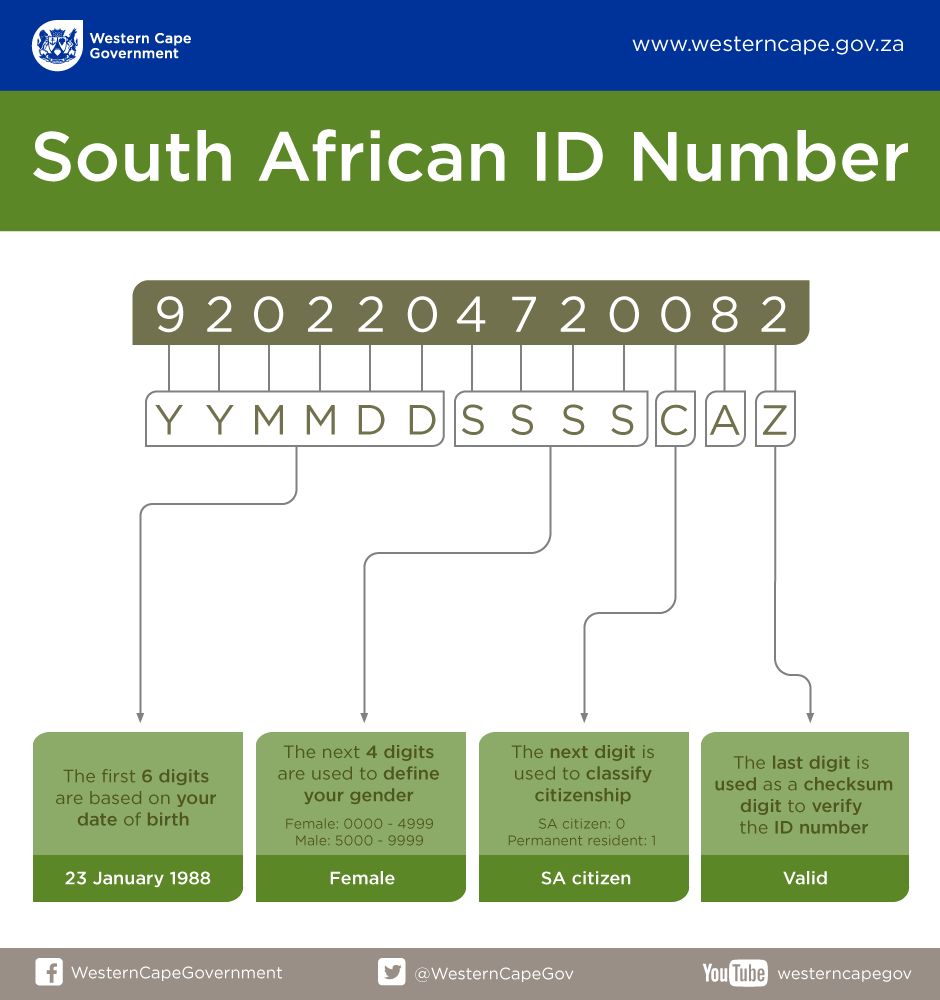

ZAIDNumber
==========

A simple gem for working with South African ID numbers.

Details
=======

South African ID numbers have a fair amount of information serialized into them, including an all important checksum number. The below information is taken from a page deep within [The Western Cape Government's website](https://www.westerncape.gov.za/general-publication/decoding-your-south-african-id-number-0).

A South African ID number is a 13-digit number which is defined by the following format: `YYMMDDSSSSCAZ`.

-	The first 6 digits (`YYMMDD`) are based on your date of birth. **20 February 1992** is displayed as `920220`.
-	The next 4 digits (`SSSS`) are used to define your gender. Females are assigned numbers in the range 0000-4999 and males from 5000-9999.
-	The next digit (`C`) shows if you're a ZA citizen status, with 0 denoting that you were born a ZA citizen and 1 denoting that you're a permanent resident.
-	The last digit (`Z`) is a checksum digit – used to check that the number sequence is accurate using a set formula called the [Luhn algorithm](https://en.wikipedia.org/wiki/Luhn_algorithm).

The graphic below details the different sections of an ID number, based on the fictitious sequence `9202204720082`



Installation
------------

Add this line to your application's Gemfile:

```ruby
gem 'za_id_number'
```

And then execute:

```
$ bundle
```

Or install it yourself as:

```
$ gem install za_id_number
```

Usage
-----

Given a valid ZA ID Number, `7501151234085`, the following interface is available:

```ruby
id_number = ZAIDNumber.new('7501151234085') # => #<ZAIDNumber:0x00d40 @id_number="75011...
```

### Validation checks

```ruby
id_num.has_valid_length?      # => true
id_num.has_only_digits?       # => true
id_num.has_valid_date?        # => true
id_num.has_valid_citizenship? # => true
id_num.has_valid_checksum?    # => true
```

Or, roll up all those validation checks into one call:

```ruby
id_number.valid? # => true
```

### Information about the data embedded in the ID Number

You can also use this gem to extract information embedded in the ID number as per the infographic above.

```ruby
id_num.date_of_birth       # => #<Date: 1975-01-15 ((2442428j,0s,0n),+0s,2299161j)>
id_num.gender              # => :f
id_num.female?             # => true
id_num.male?               # => false
id_num.citizenship         # => :za_citizen
id_num.za_citizen?         # => true
id_num.permanent_resident? # => false
```

Development
-----------

After checking out the repo, run `bin/setup` to install dependencies. Then, run `rake spec` to run the tests. You can also run `bin/console` for an interactive prompt that will allow you to experiment.

To install this gem onto your local machine, run `bundle exec rake install`. To release a new version, update the version number in `version.rb`, and then run `bundle exec rake release`, which will create a git tag for the version, push git commits and tags, and push the `.gem` file to [rubygems.org](https://rubygems.org).

Contributing
------------

Bug reports and pull requests are welcome on GitHub at https://github.com/zero-one-software/za_id_number. This project is intended to be a safe, welcoming space for collaboration, and contributors are expected to adhere to the [Contributor Covenant](http://contributor-covenant.org) code of conduct.

License
-------

The gem is available as open source under the terms of the [MIT License](http://opensource.org/licenses/MIT).
